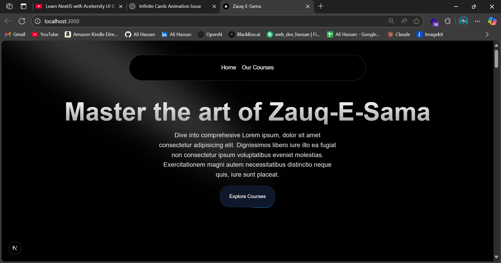
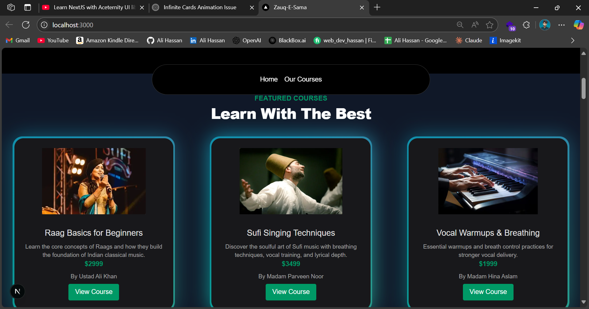
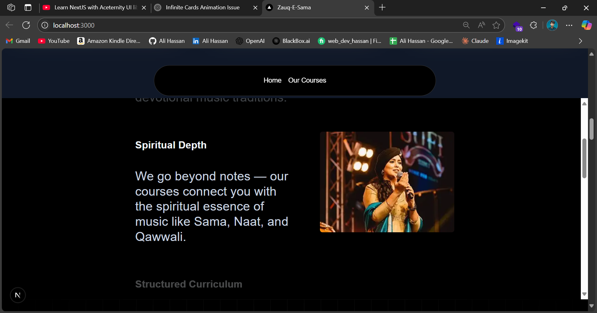
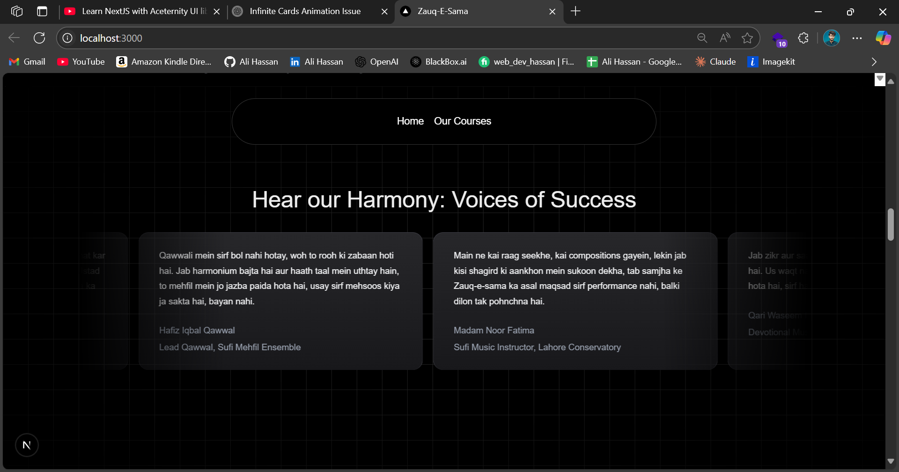
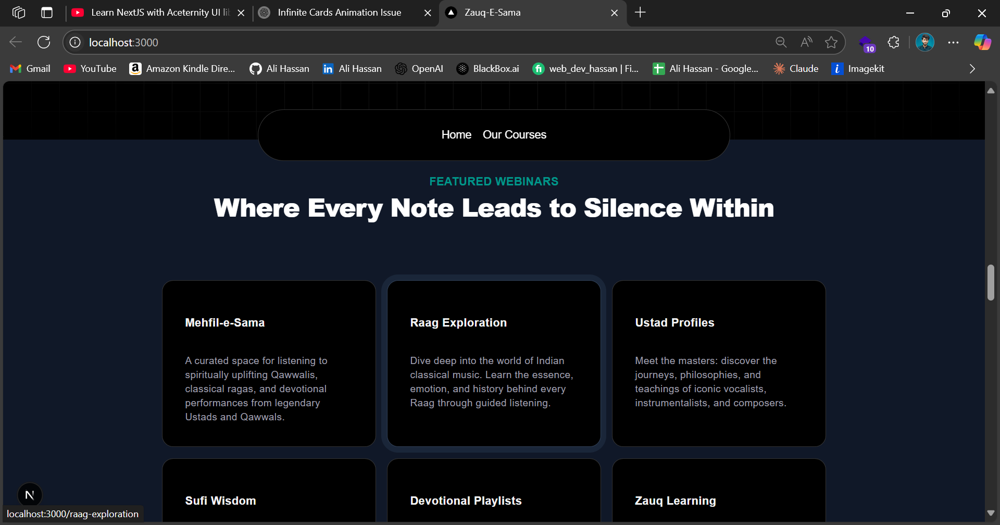
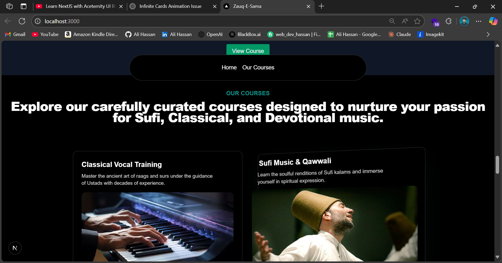
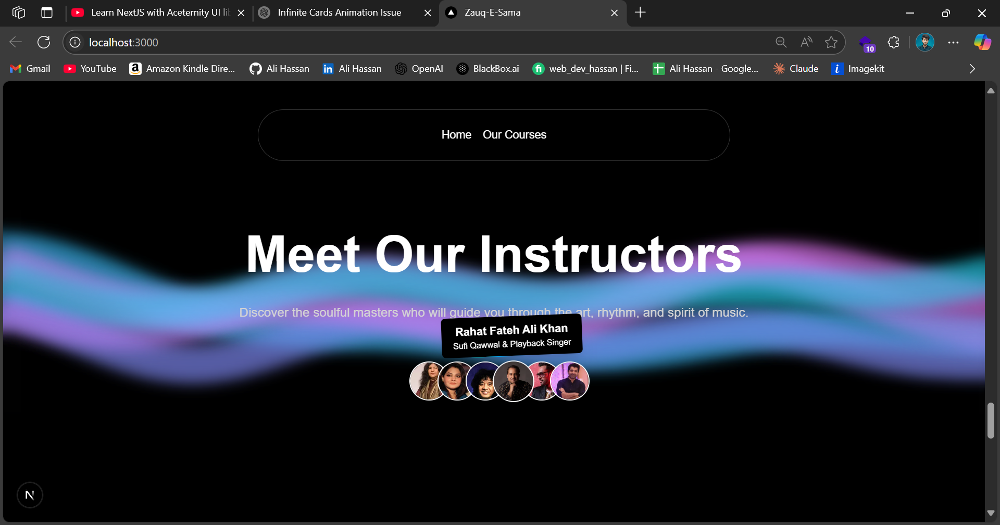
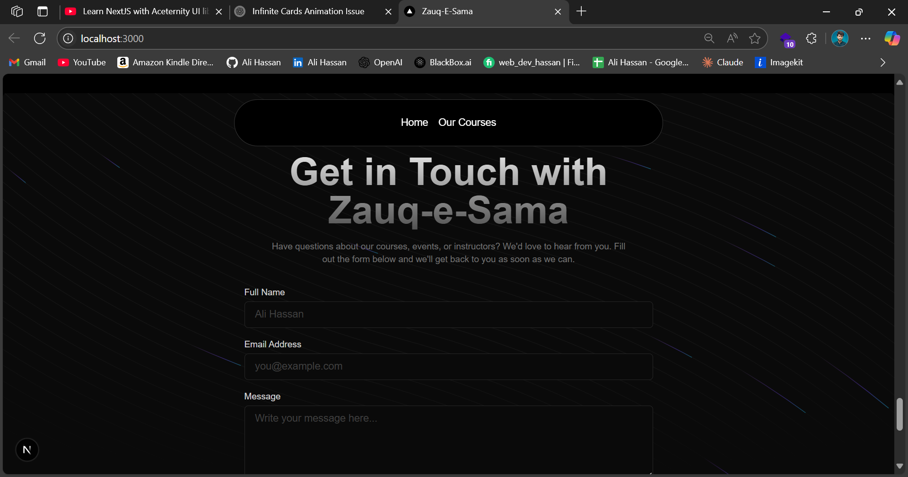
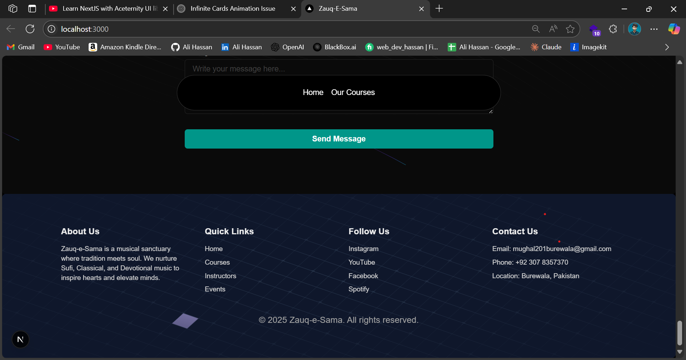

### 🎶 Zauq-e-Sama

**Zauq-e-Sama** is a modern web application celebrating the essence of classical, Sufi, and devotional music. This platform showcases instructors, courses, testimonials, events, and allows music lovers to engage deeply with rich musical traditions.

## 🚀 Tech Stack

- **Next.js** – React-based framework for server-side rendering and routing.
- **Tailwind CSS** – Utility-first CSS framework for rapid UI development.
- **Aceternity UI** – Beautiful, animated UI components that enhance the user experience.

## 📸 Screenshots











## 🔑 Features

- 🎼 Explore rich musical traditions through curated courses
- 👨‍🏫 Meet seasoned instructors from classical and Sufi backgrounds
- 💬 Read testimonials from students and artists
- 📬 Contact form to get in touch with the team
- 📱 Fully responsive & interactive UI using Aceternity components

## 🧑‍💻 Getting Started

1. **Clone the repo**

```bash
git clone https://github.com/AliHasnM/zauq-e-sama.git
cd zauq-e-sama
```

2. **Install dependencies**

```bash
npm install
```

3. **Run the development server**

```bash
npm run dev
```

> Visit [http://localhost:3000](http://localhost:3000) in your browser.

## 📁 Folder Structure

```bash
.
├── app/
│   ├── components/
│   │   ├── ui/                   # All Aceternity / reusable UI components
│   │   ├── Page.tsx
│   ├── layout.tsx               # (Optional) Layout wrapper if needed
│   └── page.tsx                 # Main landing page
├── data/
├── lib/
│   └── utils.ts
├── public/
├── .env
├── next.config.js
├── tailwind.config.js
├── tsconfig.json
└── README.md
```

## 🌐 Deployment

This app can be deployed on:

- [Vercel](https://vercel.com/)
- [Netlify](https://netlify.com/)

## 📬 Contact

Have questions or suggestions?

📧 Email: [mughal201burewala@gmail.com](mailto:mughal201burewala@gmail.com)
📍 Location: Burewala, Pakistan

---

> Made with ❤️ by Zauq-e-Sama Team (Ali Hassan)

---
